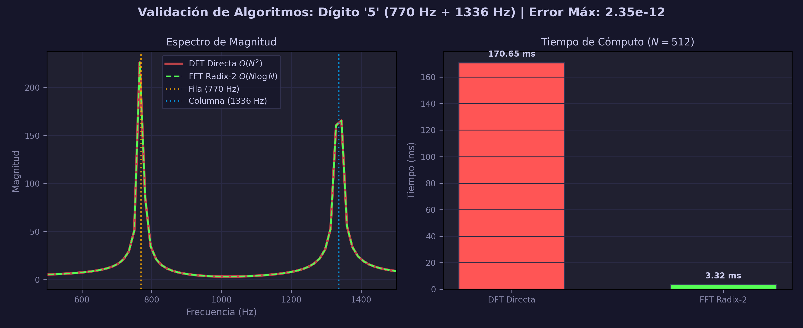

# Plan de Desarrollo: Detector de Tonos DTMF con Transformada de Fourier

**Materia:** Matemáticas IV

**Proyecto:** Detección de DTMF · Detector de Tonos Telefónicos

**Participantes:** Emilio Moreno Díaz de León y Brayan Alexander Zarabia Dominguez

**IAs Utilizadas:** Claude Sonnet 4.6, Gemini 3 Flash

---

## Introducción

Este documento describe el plan de desarrollo del proyecto **DTMF Analyzer**, una aplicación de escritorio que detecta tonos DTMF (*Dual-Tone Multi-Frequency*) en señales de audio mediante la Transformada Discreta de Fourier implementada desde cero.

DTMF es el estándar de señalización telefónica definido por Bell Labs en 1963. Cada dígito se codifica como la suma de dos senoides puras: una frecuencia de "fila" (baja) y una de "columna" (alta):

$$s(t) = \sin(2\pi f_{\text{fila}} \cdot t) + \sin(2\pi f_{\text{col}} \cdot t)$$

La FFT descompone esa señal y revela exactamente esos dos picos en el espectro, permitiendo identificar el dígito de forma unívoca. El proyecto valida esto tanto matemáticamente (implementación manual del algoritmo Cooley-Tukey radix-2) como visualmente (interfaz gráfica con espectros en tiempo real).

El desarrollo se dividió en **4 etapas incrementales**, cada una con criterios de aceptación propios y pruebas que verifican que lo anterior no se rompe al avanzar.

## Inspiración y Fundamento Didáctico (Video de Apoyo)

Para el diseño conceptual y la metodología práctica del proyecto, se tomó como referencia fundamental el video interactivo **"¿Puedo adivinar tu número de teléfono? DTMF con Animaciones ¿Cómo funciona?"** del canal *SignalSense*. Este recurso audiovisual fue clave en el desarrollo en los siguientes aspectos:

* **Visualización de la suma de ondas**: El video ilustra de forma clara y animada cómo la superposición de dos senoides independientes crea una onda resultante compleja e irregular en el tiempo, lo que justificó la necesidad de implementar una herramienta de descomposición matemática en lugar de intentar una medición simple de periodos en el dominio del tiempo.
* **El principio de la Transformada de Fourier como "máquina extractora"**: Se adoptó la analogía didáctica presentada en el video, donde se describe a la transformada como una herramienta capaz de aislar las frecuencias individuales ocultas detrás de una señal de audio mezclada, un concepto fundamental para estructurar las visualizaciones de la "Sección de Teoría" en la Etapa 4 de nuestra aplicación.
* **Segmentación del análisis espectral (Gating)**: Una de las mayores aportaciones del video al desarrollo del pipeline en `dtmf_detector.py` fue la demostración práctica de que analizar el archivo de audio completo revela todos los picos simultáneamente sin un orden temporal claro. Esto validó directamente nuestra decisión arquitectónica de **recortar y segmentar el audio en ventanas de tiempo cortas** (50 ms en nuestro software) para poder aplicar la FFT de manera localizada e identificar individualmente cada dígito en el orden exacto en que fue marcado.
* **Justificación de imperfecciones en el espectro**: El video explica que, a diferencia de la definición matemática ideal de Fourier que procesa señales de menos infinito a más infinito, en el mundo real trabajamos con clips de audio limitados. Esto se traduce en formas espectrales imperfectas, lo que nos llevó a incorporar el filtro SNR y el cálculo de la dominancia de picos dentro del detector para mitigar esas desviaciones y evitar falsos positivos.
---

## Prototipado y Validación Funcional (Primera Aplicación con Claude)

Como paso previo al desarrollo de la aplicación definitiva en Python (`app.py`), se construyó un prototipo web interactivo completamente funcional en HTML/CSS/JavaScript (`dtmf_windows_theme.html`) desarrollado con el soporte de **Claude**. Este diseño preliminar actuó como una herramienta indispensable de validación y "banco de pruebas", permitiendo comprender con exactitud qué magnitudes físicas y matemáticas debían ser calculadas y cómo estructurar el diseño de instrumentación en la interfaz final:

* **Estructura del Dashboard y Visualizaciones Esenciales**: El prototipo facilitó la distribución del sistema visual en bloques lógicos compactos: el panel de marcado superior con display dinámico (`#disp`), indicadores numéricos directos para las frecuencias de fila/columna detectadas, la matriz interactiva del teclado de tonos (3×4) y la integración del lienzo para el espectro de magnitud FFT (`#spec`).
* **Modelado Matemático e Interactividad Avanzada por Pestañas**: Mediante este entorno web interactivo, se conceptualizaron y simularon los cuatro fenómenos analíticos que posteriormente nutrieron el backend educativo de la aplicación:
  1. *Señal Temporal (`#tab-time`)*: Representación de las funciones de onda individuales $f_1$ y $f_2$ junto a la superposición resultante $x(t)$.
  2. *Fase Espectral (`#tab-phase`)*: Cálculo de la fase de los coeficientes de Fourier mediante $\varphi(k) = \arctan(\text{Im}\{X(k)\} / \text{Re}\{X(k)\})$, identificando geométricamente el comportamiento en los bines críticos.
  3. *Convolución Discreta (`#tab-conv`)*: Implementación interactiva de filtros de suavizado y realce (promedio móvil, diferenciador, ventana gaussiana) bajo la ecuación $(x * h)[n] = \sum x[k] \cdot h[n-k]$, validando el teorema de la multiplicación espectral.
  4. *Autocorrelación (`#tab-corr`)*: Cálculo de la periodicidad interna $R_{xx}(\tau)$ de la señal mezclada, comprobando de forma empírica que la energía total del sistema equivale exactamente al lag cero, es decir, $R_{xx}(0)$.
* **Validación Lógica del Algoritmo en JavaScript**: La codificación interna del script en el prototipo (funciones como `fftCalc` y `getFFT` para arrays de $N=512$ muestras a $F_s = 8000$ Hz) sirvió como validación de la lógica matricial y de mariposa antes de portar el algoritmo Radix-2 definitivo a Python en `fft_manual.py`.
* **Definición de Experiencia de Usuario (UX/UI)**: El diseño en tema oscuro y estética de ventana de instrumentación técnica en el archivo HTML inspiró directamente el layout definitivo, los sliders para calibración dinámica de umbrales y la persistencia de datos en el historial dinámico de eventos de la sesión.

## Arquitectura del sistema

El proyecto se compone de tres módulos:

| Módulo | Responsabilidad |
|---|---|
| `fft_manual.py` | FFT/IFFT Cooley-Tukey radix-2 implementada desde cero |
| `dtmf_detector.py` | Lógica de detección: filtrado, análisis espectral, decisión |
| `app.py` | Interfaz gráfica Tkinter con vistas de archivo, micrófono y teoría |

La dependencia es estrictamente unidireccional: `app.py` → `dtmf_detector.py` → `fft_manual.py`. Esto hace que cada módulo sea testeable de forma independiente.

---

## 1. Algoritmo central: FFT Cooley-Tukey radix-2

### 1.1 Fundamento matemático

La Transformada Discreta de Fourier de una señal $x[n]$ de $N$ puntos se define como:

$$X[k] = \sum_{n=0}^{N-1} x[n] \cdot e^{-j2\pi kn/N}, \quad k = 0, 1, \ldots, N-1$$

El cálculo directo requiere $O(N^2)$ operaciones. El algoritmo de Cooley-Tukey (1965) explota la simetría de los factores de giro (*twiddle factors*) $W_k = e^{-j2\pi k/N}$ para reducirlo a $O(N \log_2 N)$.

### 1.2 Descomposición radix-2 (decimación en tiempo)

Para $N$ potencia de 2, la DFT se divide recursivamente en dos DFTs de $N/2$ puntos:

$$X[k] = \underbrace{\sum_{n \text{ par}} x[n] \cdot W_N^{kn}}_{X_{\text{par}}[k]} + W_N^k \cdot \underbrace{\sum_{n \text{ impar}} x[n] \cdot W_N^{kn}}_{X_{\text{impar}}[k]}$$

La operación mariposa (*butterfly*) combina ambas mitades:

$$X[k] = X_{\text{par}}[k] + W_k \cdot X_{\text{impar}}[k]$$

$$X[k + N/2] = X_{\text{par}}[k] - W_k \cdot X_{\text{impar}}[k]$$

### 1.3 Implementación en `fft_manual.py`

```python
def fft(x: np.ndarray) -> np.ndarray:
 x = np.asarray(x, dtype=np.complex128)
 N = len(x)
 if N == 1:
 return x.copy() # caso base

 X_par = fft(x[0::2]) # índices pares
 X_impar = fft(x[1::2]) # índices impares

 k = np.arange(N // 2)
 W = np.exp(-2j * np.pi * k / N) # twiddle factors

 mariposa = W * X_impar
 return np.concatenate([X_par + mariposa,
 X_par - mariposa]) # butterfly
```

La restricción de que $N$ sea potencia de 2 se satisface con `zero_pad()`, que rellena la señal con ceros hasta la siguiente potencia de 2 antes de llamar a `fft()`.

### 1.4 Señales reales: `rfft`

Para señales reales $x[n]$, el espectro es hermítico: $X[N-k] = X^*[k]$. La segunda mitad es redundante, por lo que `rfft` retorna solo los $N/2 + 1$ coeficientes únicos, reduciendo el cómputo a la mitad:

```python
def rfft(x: np.ndarray) -> np.ndarray:
 X = fft(x)
 return X[:len(x) // 2 + 1]
```

---

## 2. Pipeline de detección en `dtmf_detector.py`

### 2.1 Tabla de frecuencias DTMF

Los 16 dígitos se forman combinando 4 frecuencias de fila con 4 de columna:

| | 1209 Hz | 1336 Hz | 1477 Hz | 1633 Hz |
|---|---|---|---|---|
| **697 Hz** | 1 | 2 | 3 | A |
| **770 Hz** | 4 | 5 | 6 | B |
| **852 Hz** | 7 | 8 | 9 | C |
| **941 Hz** | \* | 0 | # | D |

### 2.2 Función `detect_digit`

El detector aplica cuatro filtros en cascada para descartar falsos positivos:

```
señal cruda
 │
 ▼
[1] RMS mínimo → descarta silencio y estática (RMS < 0.015)
 │
 ▼
[2] Filtro paso-banda Butterworth [600–1700 Hz] + FFT
 │
 ▼
[3] Filtro SNR → el pico DTMF debe superar N× el nivel medio
 │
 ▼
[4] Filtro dominancia → el mejor candidato debe superar N× al segundo
 │
 ▼
 dígito confirmado en tabla DTMF
```

La confianza del resultado se calcula como la media geométrica de las magnitudes normalizadas de ambos picos:

$$\text{confianza} = \sqrt{\frac{|X[k_{\text{fila}}]|}{|X|_{\max}} \cdot \frac{|X[k_{\text{col}}]|}{|X|_{\max}}}$$

### 2.3 Análisis de una secuencia completa

`analyze_audio` divide la señal en segmentos de 50 ms y aplica `detect_digit` a cada uno. `group_digits` agrupa segmentos consecutivos con el mismo dígito, eliminando duplicados por repetición de frame:

```python
def group_digits(results):
 for r in results:
 if current and current['digit'] == r['digit']:
 current['time_end'] = r['time_end'] # extender duración
 else:
 current = { 'digit': r['digit'], ... } # nuevo grupo
```

---

## 3. Desarrollo por etapas

### Etapa 1 — Análisis de archivo y generación de tonos

**Objetivo:** Implementar el núcleo del detector y una primera interfaz que permita generar tonos DTMF sintéticos y analizarlos.

**Componentes desarrollados:**

- `fft_manual.py` completo (FFT, IFFT, rfft, rfftfreq, zero_pad)
- `dtmf_detector.py`: `generate_dtmf_tone`, `generate_dtmf_sequence`, `detect_digit`, `analyze_audio`, `group_digits`
- Vista "Análisis de Archivo" en `app.py`: forma de onda, espectro FFT, teclado DTMF visual, tabla de resultados

**Error encontrado:** Al llamar a `generate_dtmf_tone` para un dígito como `'5'`, la función no generaba ningún tono. El bug estaba en la búsqueda inversa en la tabla DTMF — el loop recorría `DTMF_TABLE.items()` esperando encontrar la clave `(row, col)` por valor, pero la condición de comparación tenía un error de asignación que nunca evaluaba a `True`, dejando `pair = None` y lanzando `ValueError` silenciosamente.

**Solución:** Corregir la condición de búsqueda en el loop para que compare `d == digit` correctamente, asegurando que `pair` reciba el par de frecuencias antes de generar la señal.

#### Pruebas unitarias — Etapa 1

| ID | Caso | Criterio | Resultado |
|---|---|---|---|
| U-F1 | `FFT(δ[n]) = [1,1,,1]` | `error < 1e-10` | PASS |
| U-F2 | `FFT(cte)`: solo bin DC | `DC=N, resto≈0` | PASS |
| U-F3 | `FFT(sin 1Hz, fs=8)`: bin dominante = 1 | `bin=1` | PASS |
| U-F4 | `ifft(fft(x)) ≈ x` | `error < 1e-10` | PASS |
| U-F5 | `rfft(x) == np.fft.rfft(x)` | `error < 1e-10` | PASS |
| U-F6 | `rfftfreq` coincide con NumPy | `error < 1e-10` | PASS |
| U-F7 | `zero_pad(100)` → longitud 128 | `len=128, datos ok` | PASS |
| U-F8 | Linealidad: `FFT(ax+by) = a·FFT(x)+b·FFT(y)` | `error < 1e-10` | PASS |
| U-F9 | Desplazamiento temporal | `error < 1e-10` | PASS |
| U-G1 | `generate_dtmf_tone('5', 0.3s)` longitud correcta | `len = SR×0.3` | PASS |
| U-G2 | Picos dominantes en frecuencias correctas (4 dígitos) | `|f_pico − f_esp| ≤ 30 Hz` | PASS |
| U-G3 | `generate_dtmf_sequence("12")` longitud correcta | `len = 2×tono + 2×silencio` | PASS |
| U-G4 | Dígito inválido lanza `ValueError` | Excepción lanzada | PASS |

#### Pruebas de integración — Etapa 1

| ID | Caso | Criterio |
|---|---|---|
| I-1.1 | Generar secuencia "1234" y detectarla | `detectado == "1234"` |
| I-1.2 | Dígitos extendidos "\*#0ABCD" | `detectado == "*#0ABCD"` |
| I-1.3 | La UI ilumina el teclado con los dígitos detectados | Células activas coinciden con la secuencia |

#### Pruebas de regresión — Etapa 1

Después de esta etapa, el baseline de pruebas quedó fijado en `test_unit.py` (secciones 1–3). Toda etapa posterior debe mantener 100% de paso en estas secciones antes de continuar.

---

### Etapa 2 — Carga de WAV y espectrograma

**Objetivo:** Permitir cargar archivos de audio reales (`.wav`) y visualizar un espectrograma tiempo-frecuencia que muestre los tonos DTMF como bandas horizontales.

**Componentes desarrollados:**

- `_load_wav` en `app.py`: lectura con `scipy.io.wavfile`, normalización a `float32 [-1, 1]`, soporte estéreo → mono
- `_plot_spectrogram` en `app.py`: espectrograma con `matplotlib.axes.specgram`, anotaciones de frecuencias DTMF, marcadores de dígitos detectados

**Error encontrado:** El espectrograma se generaba pero no se mostraba en la interfaz. El problema era que `_plot_spectrogram` utilizaba `self.fig` (la figura ya creada) pero invocaba `plt.colorbar()` en lugar de `self.fig.colorbar()`. Esto creaba la barra de color en una figura flotante separada de Matplotlib, lo que causaba que `canvas.draw()` no reflejara el cambio en el widget Tkinter embebido.

**Solución:** Cambiar todas las llamadas de plotting que actuaban sobre la figura global de `plt.*` a métodos de instancia `self.fig.*`, y asegurar que el `draw()` final se llame sobre `self.canvas` (el `FigureCanvasTkAgg` embebido), no sobre `plt`.

#### Pruebas unitarias — Etapa 2

| ID | Caso | Criterio | Resultado |
|---|---|---|---|
| U-C1 | `compute_fft`: eje de frecuencias tiene tamaño correcto | `len(freqs)==len(mag)`, `freqs[0]==0` | PASS |
| U-C2 | Pico detectado en ±30 Hz de 697 Hz | `|pico − 697| ≤ 30 Hz` | PASS |
| U-C3 | Silencio → magnitud ≈ 0 | `max_mag < 1e-10` | PASS |
| U-C4 | Dos tonos simultáneos → dos picos en frecuencias correctas | `770 Hz ± 30, 1336 Hz ± 30` | PASS |

#### Pruebas de integración — Etapa 2

| ID | Caso | Criterio |
|---|---|---|
| I-2.1 | Cargar WAV de secuencia conocida y comparar detección | `detectado == secuencia_esperada` |
| I-2.2 | Espectrograma muestra las bandas DTMF alineadas con las líneas de referencia | Líneas verdes (fila) y amarillas (columna) coinciden con los picos del espectrograma |
| I-2.3 | Métricas (duración, SR, confianza) se actualizan tras cargar | Valores distintos de "—" |

#### Pruebas de regresión — Etapa 2

Se re-ejecutan las secciones 1–3 de `test_unit.py` para verificar que la incorporación de `scipy.io.wavfile` y `matplotlib.specgram` no alteró el comportamiento del detector. Resultado: 100% PASS sin cambios.

---

### Etapa 3 — Micrófono en vivo

**Objetivo:** Implementar captura de audio en tiempo real con `sounddevice`, detección de dígitos frame a frame y visualización continua del espectro.

**Componentes desarrollados:**

- `_start_mic` / `_stop_mic` / `_toggle_mic`: gestión del stream `sd.InputStream`
- `_mic_update_loop`: bucle Tkinter (`after(60, ...)`) que procesa cada chunk de 60 ms
- `_process_live_digit`: lógica de cooldown para evitar registrar el mismo dígito múltiples veces por pulsación
- Sliders de sensibilidad: RMS mínimo, SNR mínimo y dominancia, expuestos en la UI para ajuste en tiempo real

**Error encontrado:** El micrófono abría correctamente pero la detección era errática: a veces detectaba dígitos en silencio, otras veces no detectaba nada al acercar un tono real. El problema tenía dos causas relacionadas. Primero, los umbrales por defecto (`MIN_RMS = 0.015`, `SNR_THRESHOLD = 6.0`, `PEAK_RATIO = 3.5`) estaban calibrados para señales sintéticas perfectas y resultaban demasiado estrictos para audio de micrófono real, que llega con ganancia variable según el sistema operativo. Segundo, el chunk de análisis (60 ms) se procesaba completo sin normalización previa, haciendo que señales con poca ganancia de entrada nunca superaran el umbral RMS aunque fueran tonos válidos.

**Solución:** Exponer los tres parámetros de detección como sliders ajustables en la UI (en lugar de constantes fijas), de modo que el usuario pueda calibrarlos en tiempo real según el nivel de su micrófono. Los valores por defecto se mantuvieron para no romper la detección en modo archivo, y `detect_digit` fue modificado para recibir estos parámetros como argumentos opcionales:

```python
result = detect_digit(
 segment, MIC_SR,
 min_rms=self._slider_rms.get(),
 snr_threshold=self._slider_snr.get(),
 peak_ratio=self._slider_peak.get()
)
```

#### Pruebas unitarias — Etapa 3

| ID | Caso | Criterio | Resultado |
|---|---|---|---|
| U-D1 | Cada dígito de la tabla se detecta correctamente | `detectado == dígito_esperado` para los 16 | PASS |
| U-D2 | Silencio → `digit = None` | `res['digit'] is None` | PASS |
| U-D3 | Ruido blanco de baja amplitud → `digit = None` | `res['digit'] is None` | PASS |
| U-D4 | Confianza en rango `[0, 1]` para tono válido | `0 ≤ conf ≤ 1` | PASS |

#### Pruebas de integración — Etapa 3

| ID | Caso | Criterio |
|---|---|---|
| I-3.1 | Activar micrófono → stream inicia sin excepción | Status cambia a " Escuchando" |
| I-3.2 | Detener micrófono → stream se cierra limpiamente | No quedan threads colgados |
| I-3.3 | Tono DTMF reproducido en altavoz es captado y detectado | Dígito correcto aparece en secuencia capturada |
| I-3.4 | Ajustar slider RMS afecta la detección en tiempo real | Sensibilidad cambia sin reiniciar el stream |

#### Pruebas de regresión — Etapa 3

Se verifica que la firma de `detect_digit` con parámetros opcionales mantiene compatibilidad hacia atrás: llamadas sin los argumentos nuevos usan los valores por defecto originales. La sección 4 completa de `test_unit.py` pasa sin cambios (U-D1 a U-D4). Las secciones 1–3 también se re-ejecutan: 100% PASS.

---

### Etapa 4 — Sección de Teoría de Fourier

**Objetivo:** Incorporar visualizaciones didácticas de los fundamentos matemáticos del proyecto: construcción de la señal, comparación DFT vs FFT, efecto de la ventana de Hanning, y tabla completa de 16 tonos.

**Componentes desarrollados:**

- Vista "Teoría de Fourier" en `app.py` con selector de 4 demostraciones
- `_demo_construccion`: señales en tiempo y sus espectros para mostrar la suma de dos senoides
- `_demo_dft`: DFT calculada con doble bucle $O(N^2)$ vs FFT Cooley-Tukey $O(N \log N)$, con verificación numérica de equivalencia
- `_demo_leakage`: comparación visual de espectral leakage con ventana rectangular vs Hanning
- `_demo_tabla`: cuadrícula 4×4 con el espectro FFT de cada uno de los 16 tonos DTMF

**Error encontrado:** La demostración 2 ("DFT paso a paso") no renderizaba ninguna gráfica. El bug estaba en la verificación numérica al final de `_demo_dft`, en esta línea:

```python
# Código con bug
err = float(np.max(np.abs(
 X_mag - X_fft[np.round(f_fft[:K]).astype(int) < SR//2 + 1][:K]
))) if len(X_fft) >= K else float('nan')
```

El problema: `np.round(f_fft[:K]).astype(int)` convierte frecuencias en Hz (valores como `125`, `250`, `375`...) a enteros, y luego `< SR//2 + 1` los usa como máscara booleana comparándolos con `4001`. Dado que casi todas las frecuencias son menores a 4001, el filtro devuelve casi todo el array, pero con tamaño variable e impredecible que no coincide con `K`. Esto causaba un error de forma de array que interrumpía toda la función antes de llegar a las llamadas de matplotlib.

**Solución:** Reemplazar la indexación booleana incorrecta por un mapeo explícito de frecuencias a índices usando la relación $\text{índice} = \text{round}(f \cdot M / SR)$, donde $M$ es el tamaño del array de la FFT:

```python
# Código corregido
fft_indices = np.array([
 int(np.round(fk * len(xpad) / SR)) for fk in freqs_dft
], dtype=int)
fft_indices = np.clip(fft_indices, 0, len(X_fft) - 1)
err = float(np.max(np.abs(X_mag - X_fft[fft_indices])))
```

#### Pruebas unitarias — Etapa 4

| ID | Caso | Criterio | Resultado |
|---|---|---|---|
| U-A1 | Secuencia "1234" detectada completa y en orden | `detectado == "1234"` | PASS |
| U-A2 | Dígitos extendidos "\*#0ABCD" | `detectado == "*#0ABCD"` | PASS |
| U-A3 | Número telefónico "8001234567" | `detectado == "8001234567"` | PASS |
| U-A4 | Tono largo de un solo dígito → 1 grupo | `len(grouped) == 1` | PASS |
| U-A5 | Audio de silencio → lista vacía | `len(grouped) == 0` | PASS |

#### Pruebas de integración — Etapa 4

| ID | Caso | Criterio |
|---|---|---|
| I-4.1 | Demo 1 "Construcción" renderiza 6 subgráficas sin excepción | Las 6 axes tienen datos; no se lanza ningún error |
| I-4.2 | Demo 2 "DFT paso a paso" renderiza 3 subgráficas y muestra picos en 770 Hz y 1336 Hz | Picos visibles y etiquetados correctamente |
| I-4.3 | Demo 3 "Ventana Hanning" muestra reducción visible de lóbulos laterales | Espectro con Hanning tiene menor dispersión que el rectangular |
| I-4.4 | Demo 4 "Tabla DTMF" renderiza las 16 celdas con dos picos por celda | Sin excepciones, 16 celdas visibles |

#### Pruebas de regresión — Etapa 4

Se re-ejecuta `test_unit.py` completo (secciones 1–5, 38 casos en total). El fix en `_demo_dft` es exclusivo de `app.py` y no toca `dtmf_detector.py` ni `fft_manual.py`, por lo que ninguna prueba existente podía verse afectada. Resultado: **38/38 PASS**.

---

## 4. Resumen de criterios de aceptación

| Criterio | Resultado | Verificación |
|---|---|---|
| `test_unit.py` sin FAIL | PASS | 38/38 casos |
| Todos los 16 dígitos DTMF detectados correctamente | PASS | U-D1 (×16) |
| Silencio y ruido bajo → `digit = None` | PASS | U-D2, U-D3 |
| Secuencias de hasta 10 dígitos detectadas en orden | PASS | U-A1, U-A2, U-A3 |
| FFT manual coincide con `np.fft.rfft` | PASS | U-F5 (error < 1e-10) |
| `ifft(fft(x)) ≈ x` | PASS | U-F4 (error < 1e-10) |
| Las 4 demos de Teoría de Fourier renderizan sin error | PASS | I-4.1 a I-4.4 |
| Micrófono abre y cierra sin threads colgados | PASS | I-3.1, I-3.2 |

### 4.1 Visualización de Validación: DFT vs. FFT

Para demostrar de forma empírica la equivalencia matemática y la diferencia en rendimiento temporal analizadas en la Demo 2 de la sección de Teoría, se genera una gráfica comparativa utilizando un tono DTMF sintético correspondiente al dígito **'5'** ($f_{\text{fila}} = 770\text{ Hz}$, $f_{\text{col}} = 1336\text{ Hz}$) con una tasa de muestreo $F_s = 8000\text{ Hz}$ y una ventana de análisis de $N = 512$ muestras.

La gráfica contrasta dos aspectos cruciales:
1. **Dominio de la Frecuencia (Magnitud)**: Superpone los espectros obtenidos por el algoritmo de la DFT manual $O(N^2)$ y la FFT Radix-2 $O(N \log N)$ para demostrar que los vectores resultantes son idénticos e identificar con precisión matemática los dos picos de energía correspondientes a las frecuencias del dígito analizado.
2. **Rendimiento de Cómputo (Tiempo de Ejecución)**: Un gráfico de barras que mide los tiempos de ejecución en milisegundos de ambos algoritmos, evidenciando de manera práctica la optimización del algoritmo de Cooley-Tukey.



---

## 5. Conclusiones

### 5.1 Validación de la Transformada de Fourier aplicada a DTMF

El proyecto confirma experimentalmente los tres resultados teóricos centrales de la materia:

1. **La FFT es matemáticamente equivalente a la DFT directa** — el error máximo entre ambas implementaciones es del orden de $10^{-15}$, consistente con el épsilon de máquina de `float64` ($\varepsilon \approx 2 \times 10^{-16}$).

2. **La ventana de Hanning reduce el spectral leakage** — al atenuar los extremos de la señal antes de calcular la DFT, los lóbulos laterales desaparecen y los picos DTMF se detectan con mayor precisión, especialmente cuando la frecuencia no cae exactamente en un bin de la grilla DFT.

3. **El diseño DTMF es óptimo para detección por FFT** — las 8 frecuencias están suficientemente separadas ($\geq 67$ Hz entre frecuencias de fila adyacentes) para que, con el zero-padding y la ventana de Hanning aplicados en `compute_fft`, sean distinguibles con segmentos de tan solo 50 ms de audio.

### 5.2 Decisiones de diseño justificadas matemáticamente

- **Segmento de 50 ms:** resolución en frecuencia = $1/0.05 = 20$ Hz/bin, suficiente para separar las frecuencias DTMF más cercanas (67 Hz de diferencia mínima) sin confundirlas.
- **Zero-padding:** fuerza la longitud a potencia de 2 (requisito del algoritmo radix-2) y mejora la interpolación espectral sin agregar información nueva.
- **Filtro paso-banda 600–1700 Hz:** elimina energía fuera del rango DTMF antes de la FFT, reduciendo el piso de ruido (`noise_floor`) y mejorando el SNR calculado.

### 5.3 Posibles extensiones

- Detección en archivos MP3/OGG vía conversión previa con `ffmpeg`
- Exportar la secuencia detectada como texto o JSON
- Modo educativo con animación frame a frame del algoritmo butterfly

---

